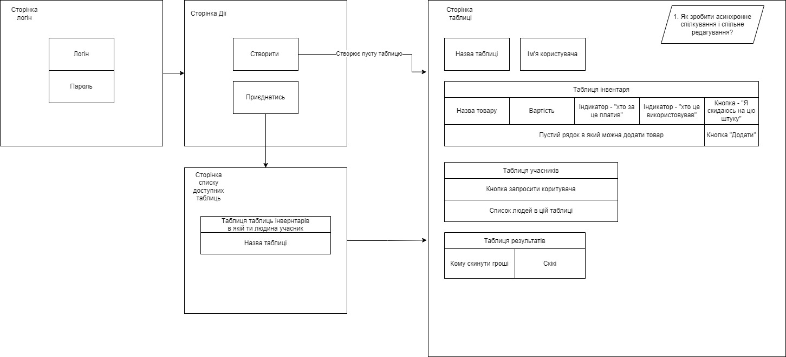

# Tusa budget

## Requirements

* python == 3.9
* req.txt

## Run

1. Run locally (`uvicorn`):

    `make run`

2. Run with db (`Postgres`)

    `docker compose --env-file ./dev.env up` or `make compose-up`

    Note:
        Don't forget to fill in corresponding values found in `example.env` (I suggest creating new file and naming it `dev.env`)

## Docs

### Ideas

1. Notifications to send money

### User Flow

## Development

This paragraph will contain extra details on how I'm structuring my development process.

1. Commit messages:

    I'm following this guide for writing commit messages https://www.conventionalcommits.org/en/v1.0.0/#summary 
    
    with extentions from this link: https://github.com/angular/angular/blob/22b96b9/CONTRIBUTING.md#-commit-message-guidelines 